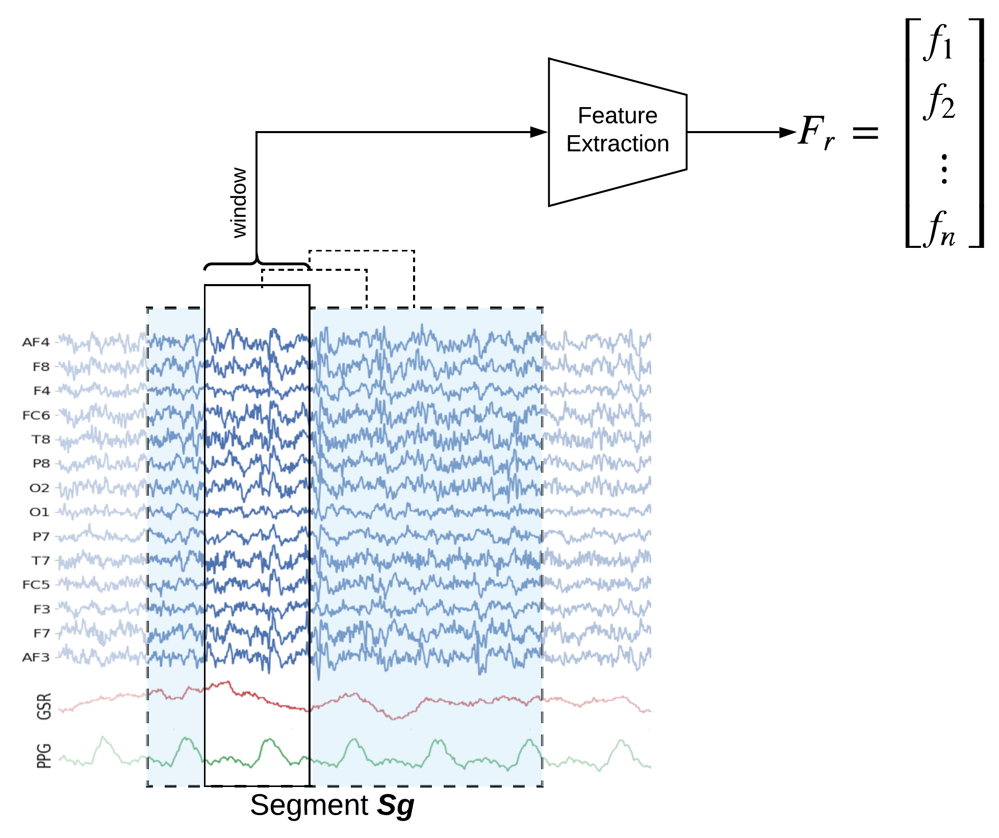

# Feature Extraction Framework

In this notebook, we explain how to extract features segment-wise and window-wise ([check the paper for theoretical details](https://arxiv.org/pdf/2005.11577.pdf)). We would also explain the possible parameters to tune the feature extraction process. PhyAAt library has function to extract Rhythemic features from EEG; either segment-wise or window-wise, so we focus on only EEG feature extraction. Custom features from EEG, PPG or GSR can be done in similar fashion. Figure below shows Feature-Extraction Framework described in [paper](https://arxiv.org/pdf/2005.11577.pdf).

<p style="text-align:right; font-weight:bold;">Execute with <br><a class="reference external image-reference" href="https://mybinder.org/v2/gh/Nikeshbajaj/Notebooks/master?filepath=PhyAAt_Notebooks/Example3_FeatureExtraction.ipynb" target="_blank"></a></p>

<!-- width="70%" -->
<center>

</center>

<!--  -->

<!--  -->
<!-- https://github.com/PhyAAt/PhyAAt.github.io/blob/master/modeling/figures/featureextraction_win.png?raw=true -->


<h2>Table of Contents<span class="tocSkip"></span></h2>
<div class="toc"><ul class="toc-item"><li><span><a href="#Read-the-data-of-subject=1" data-toc-modified-id="Read-the-data-of-subject=1-1"><span class="toc-item-num">1&nbsp;&nbsp;</span>Read the data of subject=1</a></span></li><li><span><a href="#Filtering" data-toc-modified-id="Filtering-2"><span class="toc-item-num">2&nbsp;&nbsp;</span>Filtering</a></span></li><li><span><a href="#Artifact-removal-using-ICA" data-toc-modified-id="Artifact-removal-using-ICA-3"><span class="toc-item-num">3&nbsp;&nbsp;</span>Artifact removal using ICA</a></span></li><li><span><a href="#T4:-LWR-Classification" data-toc-modified-id="T4:-LWR-Classification-4"><span class="toc-item-num">4&nbsp;&nbsp;</span>T4: LWR Classification</a></span><ul class="toc-item"><li><span><a href="#Segment-wise-feature-extraction" data-toc-modified-id="Segment-wise-feature-extraction-4.1"><span class="toc-item-num">4.1&nbsp;&nbsp;</span>Segment-wise feature extraction</a></span></li><li><span><a href="#Window-wise-Feature-Extraction-(2sec-window)" data-toc-modified-id="Window-wise-Feature-Extraction-(2sec-window)-4.2"><span class="toc-item-num">4.2&nbsp;&nbsp;</span>Window-wise Feature Extraction (2sec window)</a></span><ul class="toc-item"><li><span><a href="#Notice-the-number-of-exmaples-(Shape-of-X,-y)" data-toc-modified-id="Notice-the-number-of-exmaples-(Shape-of-X,-y)-4.2.1"><span class="toc-item-num">4.2.1&nbsp;&nbsp;</span>Notice the number of exmaples (Shape of X, y)</a></span></li></ul></li></ul></li><li><span><a href="#Tuning-Feature-Extraction-process" data-toc-modified-id="Tuning-Feature-Extraction-process-5"><span class="toc-item-num">5&nbsp;&nbsp;</span>Tuning Feature Extraction process</a></span></li></ul></div>

## Import Libraries

```python
import numpy as np
import pandas as pd
import matplotlib.pyplot as plt
from sklearn import svm
```


```python
import phyaat
print('Version :' ,phyaat.__version__)
import phyaat as ph
```

    PhyAAt Processing lib Loaded...
    Version : 0.0.2


## Read the data of subject=1

```python
dirPath = ph.download_data(baseDir='../PhyAAt_Data', subject=1,verbose=0,overwrite=False)

baseDir='../PhyAAt_Data'

SubID = ph.ReadFilesPath(baseDir)

Subj = ph.Subject(SubID[1])
```

    Total Subjects :  1


## Filtering
**With Custum frequency range**


```python
Subj.filter_EEG(band =[0.5],btype='highpass',order=5)
```

## Artifact removal using ICA
**Tune threshold, windowsize, ICA method**


```python
KurThr = 2
Corr   = 0.8
ICAMed = 'extended-infomax' #picard, fastICA
winsize=128*10 # 20sec

Subj.correct(method='ICA',winsize=winsize,hopesize=None,Corr=Corr,KurThr=KurThr,
            ICAMed=ICAMed,verbose=1,
             window=['hamming',True],winMeth='custom')
```

    ICA Artifact Removal : extended-infomax
    100%|###########################################################|


## Feature Extraction for T4: LWR Classification

### Segment-wise feature extraction

<center>

</center>


For extracting segment-wise features set  ```winsize=-1```, which will extract 84 (=6x14) features from each segment

```python
X_train,y_train,X_test, y_test = Subj.getXy_eeg(task=4,features='rhythmic',verbose=1,
                                  redo=False, winsize=-1,hopesize=None)

```

    100%|##################################################|100\100|Sg - 0
    Done..
    100%|##################################################|100\100|Sg - 1
    Done..
    100%|##################################################|100\100|Sg - 2
    Done..
    100%|##################################################|43\43|Sg - 0
    Done..
    100%|##################################################|43\43|Sg - 1
    Done..
    100%|##################################################|43\43|Sg - 2
    Done..


Shape of X_train,y_train,X_test, y_test

```python
print('DataShape: ',X_train.shape,y_train.shape,X_test.shape, y_test.shape)
print('\nClass labels :',np.unique(y_train))
```

    DataShape:  (290, 84) (290,) (120, 84) (120,)

    Class labels : [0 1 2]


```python
# Normalization - SVM works well with normalized features
means = X_train.mean(0)
std   = X_train.std(0)
X_train = (X_train-means)/std
X_test  = (X_test-means)/std


# Training
clf = svm.SVC(kernel='rbf', C=1,gamma='auto')
clf.fit(X_train,y_train)

# Predition
ytp = clf.predict(X_train)
ysp = clf.predict(X_test)

# Evaluation
print('Training Accuracy:',np.mean(y_train==ytp))
print('Testing  Accuracy:',np.mean(y_test==ysp))
```

    Training Accuracy: 0.9448275862068966
    Testing  Accuracy: 0.85


### Window-wise Feature Extraction (2sec window)

<center>

</center>

For extracting Window-wise features with window size 2sec and 50% overlapping set  ```winsize=128*2```, which will extract 84 (=6x14) features from each window


```python
X_train,y_train,X_test, y_test = Subj.getXy_eeg(task=4,features='rhythmic',
                                  verbose=1, redo=True, winsize=128*2)
```

    100%|##################################################|100\100|Sg - 0
    Done..
    100%|##################################################|100\100|Sg - 1
    Done..
    100%|##################################################|100\100|Sg - 2
    Done..
    100%|##################################################|43\43|Sg - 0
    Done..
    100%|##################################################|43\43|Sg - 1
    Done..
    100%|##################################################|43\43|Sg - 2
    Done..


#### Notice the number of exmaples (Shape of X, y)

Shape of X_train,y_train,X_test, y_test

```python
print('DataShape: ',X_train.shape,y_train.shape,X_test.shape, y_test.shape)
print('\nClass labels :',np.unique(y_train))
```

    DataShape:  (1382, 84) (1382,) (565, 84) (565,)

    Class labels : [0 1 2]


```python
# Normalization - SVM works well with normalized features
means = X_train.mean(0)
std   = X_train.std(0)
X_train = (X_train-means)/std
X_test  = (X_test-means)/std


# Training
clf = svm.SVC(kernel='rbf', C=1,gamma='auto')
clf.fit(X_train,y_train)

# Predition
ytp = clf.predict(X_train)
ysp = clf.predict(X_test)

# Evaluation
print('Training Accuracy:',np.mean(y_train==ytp))
print('Testing  Accuracy:',np.mean(y_test==ysp))
```

    Training Accuracy: 0.9261939218523878
    Testing  Accuracy: 0.8407079646017699


## Tuning Feature Extraction process


```python
# Subj = ph.Subject(SubID[1])
# Subj.filter_EEG(band =[0.5],btype='highpass',order=5)
# KurThr = 2
# Corr   = 0.8
# ICAMed = 'extended-infomax' #picard, fastICA
# winsize=128*10 # 20sec

# Subj.correct(method='ICA',winsize=winsize,hopesize=None,Corr=Corr,KurThr=KurThr,ICAMed=ICAMed,verbose=1)
```


```python
#check help to see the options
help(ph.Subject.getXy_eeg)
```


```python

X_train,y_train,X_test, y_test = Subj.getXy_eeg(task=4,features='rhythmic',
                                    verbose=1,
                                    redo=False,
                                    split='serial', splitAt=100,
                                    normalize=False,log10p1=True,flat=True,
                                    filter_order=5,method='welch',
                                    window='hann', scaling='density',
                                    detrend='constant',period_average='mean',
                                    winsize=-1,hopesize=None)
```


<p style="text-align:center; font-weight:bold;">Execute with <br><a class="reference external image-reference" href="https://mybinder.org/v2/gh/Nikeshbajaj/Notebooks/master?filepath=PhyAAt_Notebooks/Example3_FeatureExtraction.ipynb" target="_blank"></a></p>
