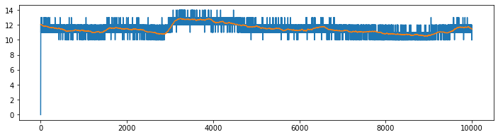

# Using External Libraries

In this notebook, we explain how to extract the signals preprocess with external libraries and do predictive modeling.

<p style="text-align:right; font-weight:bold;">Execute with <br><a class="reference external image-reference" href="https://mybinder.org/v2/gh/Nikeshbajaj/Notebooks/master?filepath=PhyAAt_Notebooks/Example4_UsingExternalLibraries.ipynb" target="_blank"></a></p>

<h2>Table of Contents<span class="tocSkip"></span></h2>
<div class="toc"><ul class="toc-item"><li><span><a href="#Read-the-data-of-subject=1" data-toc-modified-id="Read-the-data-of-subject=1-1"><span class="toc-item-num">1&nbsp;&nbsp;</span>Read the data of subject=1</a></span></li><li><span><a href="#Extract-Raw-Signals" data-toc-modified-id="Extract-Raw-Signals-2"><span class="toc-item-num">2&nbsp;&nbsp;</span>Extract Raw Signals</a></span></li></ul></div>

## Import Libraries

```python
import numpy as np
import pandas as pd
import matplotlib.pyplot as plt

from sklearn import svm
```


```python
import phyaat
print('Version :' ,phyaat.__version__)
import phyaat as ph
```

    PhyAAt Processing lib Loaded...
    Version : 0.0.2

## Read the data of subject=1

```python
dirPath = ph.download_data(baseDir='../PhyAAt_Data', subject=1,verbose=0,overwrite=False)

baseDir='../PhyAAt_Data'

SubID = ph.ReadFilesPath(baseDir)

Subj = ph.Subject(SubID[1])
```

    Total Subjects :  1


```python
Subj.filter_EEG(band =[0.5],btype='highpass',order=5)
```

## Extract Raw Signals


```python
XE = Subj.getEEG().to_numpy()
XG = Subj.getGSR().to_numpy()
XP = Subj.getPPG().to_numpy()
```


```python
plt.figure(figsize=(13,3))
plt.plot(XE[:10000,:]+np.arange(14)*100)
plt.show()
```


```python
plt.figure(figsize=(12,3))
plt.plot(XG[:10000,:])
plt.show()
```





```python
plt.figure(figsize=(12,3))
plt.plot(XP[:10000,:])
plt.show()
```


<p style="text-align:center; font-weight:bold;">Execute with <br><a class="reference external image-reference" href="https://mybinder.org/v2/gh/Nikeshbajaj/Notebooks/master?filepath=PhyAAt_Notebooks/Example4_UsingExternalLibraries.ipynb" target="_blank"></a></p>
