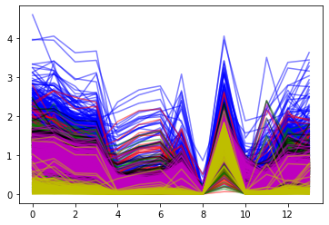
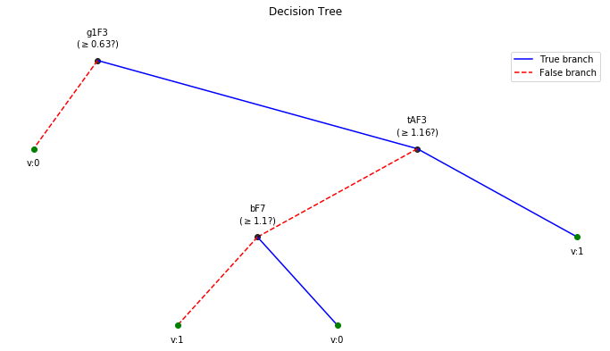

# Predictive modeling with Decision Tree
In this notebook, we explain to download the dataset and getting started with all the predictive tasks using Support Vector Machine. We will be extracting spectral features, specifically 6 rhythmic features - total power in 6 frequency bands, namely, Delta (0.5-4 Hz), Theta (4-8 Hz), Alpha (8-14 Hz), Beta (14-30 Hz), Low Gamma (30-47 Hz), and High Gamma (47-64 Hz). For preprocessing, we filter EEG first with 0.5 Hz highpass and then remove Artifact with ICA based approach.

<p style="text-align:right; font-weight:bold;">Execute with <br><a class="reference external image-reference" href="https://mybinder.org/v2/gh/Nikeshbajaj/Notebooks/master?filepath=PhyAAt_Notebooks/Example5_Modeling_with_DecisionTree.ipynb" target="_blank"></a></p>

<h2>Table of Contents<span class="tocSkip"></span></h2>
<div class="toc"><ul class="toc-item"><li><span><a href="#Download-Data---if-not-downloaded-already" data-toc-modified-id="Download-Data---if-not-downloaded-already-1"><span class="toc-item-num">1&nbsp;&nbsp;</span>Download Data - if not downloaded already</a></span></li><li><span><a href="#Locate-the-subject's-file" data-toc-modified-id="Locate-the-subject's-file-2"><span class="toc-item-num">2&nbsp;&nbsp;</span>Locate the subject's file</a></span></li><li><span><a href="#Loading-data-and-preprocessing" data-toc-modified-id="Loading-data-and-preprocessing-3"><span class="toc-item-num">3&nbsp;&nbsp;</span>Loading data and preprocessing</a></span><ul class="toc-item"><li><span><a href="#Data-of-Subject=1--[~19min]" data-toc-modified-id="Data-of-Subject=1--[~19min]-3.1"><span class="toc-item-num">3.1&nbsp;&nbsp;</span>Data of Subject=1  [~19min]</a></span></li></ul></li><li><span><a href="#Feature-Extraction---Rhythmic-Features-[~3min]" data-toc-modified-id="Feature-Extraction---Rhythmic-Features-[~3min]-4"><span class="toc-item-num">4&nbsp;&nbsp;</span>Feature Extraction - Rhythmic Features [~3min]</a></span></li><li><span><a href="#Predictive-Modeling-with-Decision-Tree" data-toc-modified-id="Predictive-Modeling-with-Decision-Tree-5"><span class="toc-item-num">5&nbsp;&nbsp;</span>Predictive Modeling with Decision Tree</a></span><ul class="toc-item"><li><span><a href="#T4-Task:-LWR-classification" data-toc-modified-id="T4-Task:-LWR-classification-5.1"><span class="toc-item-num">5.1&nbsp;&nbsp;</span>T4 Task: LWR classification</a></span></li><li><span><a href="#T3-Task:-Semanticity-classification" data-toc-modified-id="T3-Task:-Semanticity-classification-5.2"><span class="toc-item-num">5.2&nbsp;&nbsp;</span>T3 Task: Semanticity classification</a></span></li></ul></li></ul></div>


```python
import numpy as np
import pandas as pd
import matplotlib.pyplot as plt
```


```python
#!pip install phyaat  # if not installed yet

import phyaat
print('Version :' ,phyaat.__version__)
import phyaat as ph
```

    PhyAAt Processing lib Loaded...
    Version : 0.0.2


## Download Data - if not downloaded already


```python
# Download dataset of one subject only (subject=1)
# To download data of all the subjects use subject =-1 or for specify for one e.g.subject=10

dirPath = ph.download_data(baseDir='../PhyAAt_Data', subject=1,verbose=0,overwrite=False)
```

## Locate the subject's file


```python
baseDir='../PhyAAt_Data'   # or dirPath return path from above

#returns a dictionary containing file names of all the subjects available in baseDir
SubID = ph.ReadFilesPath(baseDir)

#check files of subject=1
SubID[1]
```
    Total Subjects :  1

    {'sigFile': '../PhyAAt_Data/phyaat_dataset/Signals/S1/S1_Signals.csv',
     'txtFile': '../PhyAAt_Data/phyaat_dataset/Signals/S1/S1_Textscore.csv'}


## Loading data and preprocessing

### Data of Subject=1  [~19min]


```python
# Create a Subj holding dataset of subject=1

Subj = ph.Subject(SubID[1])

#filtering with highpass filter of cutoff frequency 0.5Hz

Subj.filter_EEG(band =[0.5],btype='highpass',order=5)


#Remving Artifact using ICA, setting window size to 256 (2sec), which is larg, but takes less time

Subj.correct(method='ICA',verbose=1,winsize=128*2)
```

    ICA Artifact Removal : extended-infomax
    100%|###############################################################|


## Feature Extraction - Rhythmic Features [~3min]


```python
# setting task=-1, does extract the features from all the segmensts for all the four tasks and
# returns y_train as (n,4), one coulum for each task. Next time extracting Xy for any particular
# task won't extract the features agains, unless you force it by setting 'redo'=True.

X_train,y_train,X_test, y_test = Subj.getXy_eeg(task=4)

print('DataShape: ',X_train.shape,y_train.shape,X_test.shape, y_test.shape)
```

    100%|##################################################|100\100|Sg - 0
    Done..
    100%|##################################################|100\100|Sg - 1
    Done..
    100%|##################################################|100\100|Sg - 2
    Done..
    100%|##################################################|43\43|Sg - 0
    Done..
    100%|##################################################|43\43|Sg - 1
    Done..
    100%|##################################################|43\43|Sg - 2
    Done..
    DataShape:  (290, 84) (290,) (120, 84) (120,)


## Predictive Modeling with Decision Tree


```python
from spkit.ml import ClassificationTree
```

### T4 Task: LWR classification


```python
X_train,y_train, X_test,y_test = Subj.getXy_eeg(task=4)

print('DataShape: ',X_train.shape,y_train.shape,X_test.shape, y_test.shape)
print('\nClass labels :',np.unique(y_train))
```

    DataShape:  (290, 84) (290,) (120, 84) (120,)

    Class labels : [0 1 2]


```python
plt.plot(X_train[:,:14].T,'b',alpha=0.5)
plt.plot(X_train[:,14:14*2].T,'r',alpha=0.5)
plt.plot(X_train[:,2*14:14*3].T,'g',alpha=0.5)
plt.plot(X_train[:,3*14:14*4].T,'k',alpha=0.5)
plt.plot(X_train[:,4*14:14*5].T,'m',alpha=0.5)
plt.plot(X_train[:,5*14:14*6].T,'y',alpha=0.5)
plt.show()
```





```python
ch_names = ['AF3','F7','F3','FC5','T7','P7','O1','O2','P8','T8','FC6','F4','F8','AF4']
bands = ['d','t','a','b','g1','g2']

feature_names = [[st+ch for ch in ch_names] for st in bands]
feature_names =  [f for flist in feature_names for f in flist]
#feature_names
```


```python
clf = ClassificationTree(max_depth=3)
clf.fit(X_train,y_train,feature_names=feature_names,verbose=1)
ytp = clf.predict(X_train)
ysp = clf.predict(X_test)

ytpr = clf.predict_proba(X_train)[:,1]
yspr = clf.predict_proba(X_test)[:,1]

print('Depth of trained Tree ', clf.getTreeDepth())
print('Accuracy')
print('- Training : ',np.mean(ytp==y_train))
print('- Testing  : ',np.mean(ysp==y_test))
print('Logloss')
Trloss = -np.mean(y_train*np.log(ytpr+1e-10)+(1-y_train)*np.log(1-ytpr+1e-10))
Tsloss = -np.mean(y_test*np.log(yspr+1e-10)+(1-y_test)*np.log(1-yspr+1e-10))
print('- Training : ',Trloss)
print('- Testing  : ',Tsloss)
```

    Number of features:: 84
    Number of samples :: 290
    ---------------------------------------
    |Building the tree.....................
    |subtrees::|100%|-------------------->||
    |.........................tree is buit!
    ---------------------------------------
    Depth of trained Tree  3
    Accuracy
    - Training :  0.8758620689655172
    - Testing  :  0.7666666666666667
    Logloss
    - Training :  13.406930498304638
    - Testing  :  11.996393111286006


```python
plt.figure(figsize=(12,6))
clf.plotTree()
```


### T3 Task: Semanticity classification


```python
X_train,y_train, X_test,y_test = Subj.getXy_eeg(task=3)

print('DataShape: ',X_train.shape,y_train.shape,X_test.shape, y_test.shape)
print('\nClass labels :',np.unique(y_train))
```

    DataShape:  (100, 84) (100,) (43, 84) (43,)

    Class labels : [0 1]


```python
clf = ClassificationTree(max_depth=3)
clf.fit(X_train,y_train,feature_names=feature_names,verbose=1)
ytp = clf.predict(X_train)
ysp = clf.predict(X_test)

ytpr = clf.predict_proba(X_train)[:,1]
yspr = clf.predict_proba(X_test)[:,1]

print('Depth of trained Tree ', clf.getTreeDepth())
print('Accuracy')
print('- Training : ',np.mean(ytp==y_train))
print('- Testing  : ',np.mean(ysp==y_test))
print('Logloss')
Trloss = -np.mean(y_train*np.log(ytpr+1e-10)+(1-y_train)*np.log(1-ytpr+1e-10))
Tsloss = -np.mean(y_test*np.log(yspr+1e-10)+(1-y_test)*np.log(1-yspr+1e-10))
print('- Training : ',Trloss)
print('- Testing  : ',Tsloss)
```

    Number of features:: 84
    Number of samples :: 100
    ---------------------------------------
    |Building the tree.....................
    |subtrees::|100%|-------------------->||
    |.........................tree is buit!
    ---------------------------------------
    Depth of trained Tree  3
    Accuracy
    - Training :  0.74
    - Testing  :  0.46511627906976744
    Logloss
    - Training :  0.49239269155167276
    - Testing  :  3.7858985672861363


```python
plt.figure(figsize=(12,6))
clf.plotTree()
```



