# Semanticity Classification with EEG Artifact Removal with ATAR and Tuning

In this notebook, we demonstrate, how to apply ATAR algorithm built in spkit, whcih is combined with phyaat library now. The objective of including ATAR with phyaat is to make an easy to apply on phyaat dataset to quickly built a model for prediction task

We will only focus on one task and demonstrate the tuning part of ATAR and how that improve the performance.

In this notebook, we explain to download the dataset and getting started with all the predictive tasks using Support Vector Machine. We will be extracting spectral features, specifically 6 rhythmic features - total power in 6 frequency bands, namely, Delta (0.5-4 Hz), Theta (4-8 Hz), Alpha (8-14 Hz), Beta (14-30 Hz), Low Gamma (30-47 Hz), and High Gamma (47-64 Hz). For preprocessing, we filter EEG first with 0.5 Hz highpass and then remove Artifact with ICA based approach. 


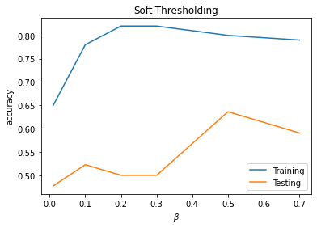

<p style="text-align:right; font-weight:bold;">Execute with <br><a class="reference external image-reference" href="https://mybinder.org/v2/gh/Nikeshbajaj/Notebooks/master?filepath=PhyAAt_Notebooks/Example7_Artifact_Removal_ATAR.ipynb" target="_blank"></a></p>

.. image:: https://raw.githubusercontent.com/spkit/spkit.github.io/master/assets/images/nav_logo.svg
    :width: 200
    :align: right
    :target: https://github.com/Nikeshbajaj/Notebooks/blob/master/PhyAAt_Notebooks/Example7_Artifact_Removal_ATAR.ipynb


<h1>Table of Contents<span class="tocSkip"></span></h1>
<div class="toc"><ul class="toc-item"><li><span><a href="#Download-and-Load-a-subject" data-toc-modified-id="Download-and-Load-a-subject-1"><span class="toc-item-num">1&nbsp;&nbsp;</span>Download and Load a subject</a></span></li><li><span><a href="#Highpass-and-lowpass-filtering" data-toc-modified-id="Highpass-and-lowpass-filtering-2"><span class="toc-item-num">2&nbsp;&nbsp;</span>Highpass and lowpass filtering</a></span></li><li><span><a href="#ATAR-Algorithm" data-toc-modified-id="ATAR-Algorithm-3"><span class="toc-item-num">3&nbsp;&nbsp;</span>ATAR Algorithm</a></span></li><li><span><a href="#T3-Task:-Semanticity-Prediction" data-toc-modified-id="T3-Task:-Semanticity-Prediction-4"><span class="toc-item-num">4&nbsp;&nbsp;</span>T3 Task: Semanticity Prediction</a></span><ul class="toc-item"><li><span><a href="#Feature-Extraction---Rhythmic-Features" data-toc-modified-id="Feature-Extraction---Rhythmic-Features-4.1"><span class="toc-item-num">4.1&nbsp;&nbsp;</span>Feature Extraction - Rhythmic Features</a></span></li><li><span><a href="#Predictive-Modeling-with-Decision-Tree" data-toc-modified-id="Predictive-Modeling-with-Decision-Tree-4.2"><span class="toc-item-num">4.2&nbsp;&nbsp;</span>Predictive Modeling with Decision Tree</a></span></li></ul></li><li><span><a href="#Tuning-ATAR" data-toc-modified-id="Tuning-ATAR-5"><span class="toc-item-num">5&nbsp;&nbsp;</span>Tuning ATAR</a></span><ul class="toc-item"><li><span><a href="#Soft-thresholding" data-toc-modified-id="Soft-thresholding-5.1"><span class="toc-item-num">5.1&nbsp;&nbsp;</span>Soft-thresholding</a></span></li><li><span><a href="#Elimination-mode" data-toc-modified-id="Elimination-mode-5.2"><span class="toc-item-num">5.2&nbsp;&nbsp;</span>Elimination mode</a></span></li></ul></li></ul></div>


```python
import numpy as np
import pandas as pd
import matplotlib.pyplot as plt
```


```python
#!pip install phyaat  # if not installed yet

import phyaat as ph
print('Version :' ,ph.__version__)
```

Version : 0.0.3
    
## Download and Load a subject

```python
# Download dataset of one subject only (subject=1)
# To download data of all the subjects use subject =-1 or for specify for one e.g.subject=10

dirPath = ph.download_data(baseDir='../PhyAAt/data/', subject=10,verbose=0,overwrite=False)
```

100%[|][##################################################] S10


```python
baseDir='../PhyAAt/data/' # or dirPath return path from above

#returns a dictionary containing file names of all the subjects available in baseDir
SubID = ph.ReadFilesPath(baseDir) 

#check files of subject=1
SubID[10]
```

Total Subjects :  3

{'sigFile': '../PhyAAt/data/phyaat_dataset/Signals/S10/S10_Signals.csv',
'txtFile': '../PhyAAt/data/phyaat_dataset/Signals/S10/S10_Textscore.csv'}


## Highpass and lowpass filtering

```python
# Create a Subj holding dataset of subject=1

Subj = ph.Subject(SubID[10])

#filtering with highpass filter of cutoff frequency 0.5Hz and lowpass with 24 Hz (no reason why)

Subj.filter_EEG(band =[0.5],btype='highpass',method='SOS',order=5)
Subj.filter_EEG(band =[24],btype='lowpass',method='SOS',order=5)
```


```python
ch_names = list(Subj.rawData['D'])[1:15]
fs=128
```

##### Let's check the signals

```python
# Let's check the signals

X0 = Subj.getEEG(useRaw=True).to_numpy()[fs*20:fs*35,1]
X1 = Subj.getEEG(useRaw=False).to_numpy()[fs*20:fs*35,1]
t = np.arange(len(X0))/fs

plt.figure(figsize=(15,3))
plt.plot(t,X0)
plt.plot(t,X1)
plt.xlim([t[0],t[-1]])
plt.xlabel('time (s)')
plt.ylabel('amplitude')
plt.show()
```

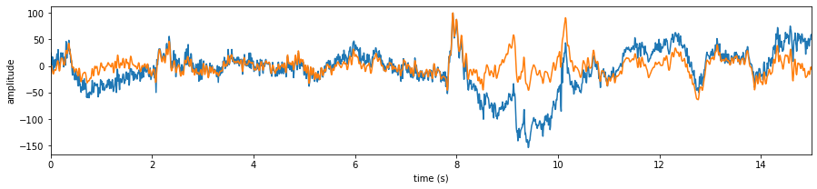
    

## ATAR Algorithm

```python
help(Subj.correct)
```

Help on method correct in module phyaat.ProcessingLib:
    
correct(method='ICA', Corr=0.8, KurThr=2, ICAMed='extended-infomax', AF_ch_index=[0, 13], F_ch_index=[1, 2, 11, 12], wv='db3', thr_method='ipr', IPR=[25, 75], beta=0.1, k1=10, k2=100, est_wmax=100, theta_a=inf, bf=2, gf=0.8, OptMode='soft', wpd_mode='symmetric', wpd_maxlevel=None, factor=1.0, packetwise=False, WPD=True, lvl=[], fs=128.0, use_joblib=False, winsize=128, hopesize=None, verbose=0, window=['hamming', True], winMeth='custom', useRaw=False) method of phyaat.ProcessingLib.Subject instance
        
    Remove Artifacts from EEG using  ATAR Algorithm or ICA
    ------------------------------------------------------
    method: 'ATAR' 'ICA',
    =====================

    # For ICA  parameters (5)
    ---------------------------
    ICAMed : (default='extended-infomax') ['fastICA','infomax','extended-infomax','picard']
    KurThr : (default=2) threshold on kurtosis to eliminate artifact, ICA component with kurtosis above threshold are removed.
    Corr   : (default=0.8), correlation threshold, above which ica components are removed.

    Details:
    ICA based approach uses three criteria
     - (1) Kurtosis based artifacts - mostly for motion artifacts
     - (2) Correlation Based Index (CBI) for eye movement artifacts
     - (3) Correlation of any independent component with many EEG channels

    To remove Eye blink artifact, a correlation of ICs are computed with AF and F

    For case of 14-channels Emotiv Epoc
    ch_names = ['AF3','F7
    PreProntal Channels =['AF3','AF4'], Fronatal Channels = ['F7','F3','F4','F8']
    AF_ch_index =[0,13] :  (AF - First Layer of electrodes towards frontal lobe)
    F_ch_index =[1,2,11,12] : (F - second layer of electrodes)

    if AF_ch_index or F_ch_index is None, CBI is not applied

    for more detail chcek
    import spkit as sp
    help(sp.eeg.ICA_filtering)


    # ATAR Algorithm Parameters
    ---------------------------
    ## default setting of parameters are as follow:
    wv='db3',thr_method ='ipr',IPR=[25,75],beta=0.1,k1=10,k2 =100,est_wmax=100,
    theta_a=np.inf,bf=2,gf=0.8,OptMode ='soft',wpd_mode='symmetric',wpd_maxlevel=None,factor=1.0,
    packetwise=False,WPD=True,lvl=[],fs=128.0,use_joblib=False

    check Ref[1] and jupyter-notebook for details on parameters:
    - https://nbviewer.org/github/Nikeshbajaj/Notebooks/blob/master/spkit/SP/ATAR_Algorithm_EEG_Artifact_Removal.ipynb

    # Common Parameters
    -------------------
    winsize=128, hopesize=None, window=['hamming',True], ReconMethod='custom' (winMeth)
    winsize: 128, window size to processe
    hopesize: 64, overlapping samples, if None, hopesize=winsize//2
    window: ['hamming',True], set window[1]=False to avoid windowing

    References:
    # ATAR
    - [1] Bajaj, Nikesh, et al. "Automatic and tunable algorithm for EEG artifact removal using wavelet decomposition with applications in predictive modeling during auditory tasks." Biomedical Signal Processing and Control 55 (2020): 101624.
    - check jupyter-notebook as tutorial here:
    - https://nbviewer.org/github/Nikeshbajaj/Notebooks/blob/master/spkit/SP/ATAR_Algorithm_EEG_Artifact_Removal.ipynb

    # [2] ICA
     - https://nbviewer.org/github/Nikeshbajaj/Notebooks/blob/master/spkit/SP/ICA_based_Artifact_Removal.ipynb


```python
#Remving Artifact using ATAR, setting window size to 128*5 (5 sec), which is larg, but takes less time

Subj.correct(method='ATAR',verbose=1,winsize=128*5,
            wv='db3',thr_method='ipr',IPR=[25,75],beta=0.1,k1=10,k2 =100,est_wmax=100,
            OptMode ='soft',fs=128.0,use_joblib=False) 
```

WPD Artifact Removal
WPD: True  Wavelet: db3 , Method: ipr , OptMode: soft
IPR= [25, 75] , Beta: 0.1 , [k1,k2]= [10, 100]
Reconstruction Method: custom , Window: ['hamming', True] , (Win,Overlap)= (640, 320)
    

```python
# Let's check signal again

X0 = Subj.getEEG(useRaw=True).to_numpy()[fs*20:fs*35,1]
X1 = Subj.getEEG(useRaw=False).to_numpy()[fs*20:fs*35,1]
t = np.arange(len(X0))/fs

plt.figure(figsize=(15,3))
plt.plot(t,X0)
plt.plot(t,X1)
plt.xlim([t[0],t[-1]])
plt.xlabel('time (s)')
plt.ylabel('amplitude')
plt.show()
```

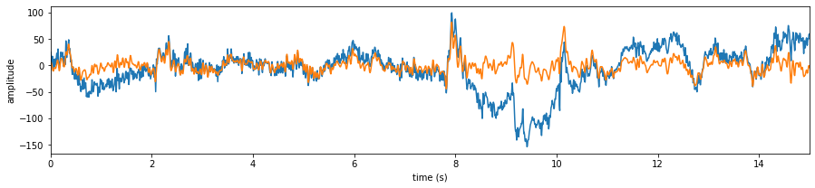
    

```python
X0 = Subj.getEEG(useRaw=True).to_numpy()[fs*20:fs*35]
X1 = Subj.getEEG(useRaw=False).to_numpy()[fs*20:fs*35]
t = np.arange(len(X0))/fs

plt.figure(figsize=(15,5))
plt.subplot(121)
plt.plot(t,X0 + np.arange(14)*50)
plt.xlim([t[0],t[-1]])
plt.xlabel('time (s)')
#plt.ylabel('amplitude')
plt.yticks(np.arange(14)*50,ch_names)
plt.subplot(122)
plt.plot(t,X1+ np.arange(14)*50)
plt.xlim([t[0],t[-1]])
plt.xlabel('time (s)')
#plt.ylabel('amplitude')
plt.yticks(np.arange(14)*50,ch_names)
plt.tight_layout()
plt.show()
```


    

## T3 Task: Semanticity Prediction

### Feature Extraction - Rhythmic Features


```python
# setting task=-1, does extract the features from all the segmensts for all the four tasks and 
# returns y_train as (n,4), one coulum for each task. Next time extracting Xy for any particular
# task won't extract the features agains, unless you force it by setting 'redo'=True.

X_train,y_train,X_test, y_test = Subj.getXy_eeg(task=3)

print('DataShape: ',X_train.shape,y_train.shape,X_test.shape, y_test.shape)
```

100%|##################################################|100\100|Sg - 0|    
100%|##################################################|44\44|Sg - 0|    
DataShape:  (100, 84) (100,) (44, 84) (44,)
    

### Predictive Modeling with Decision Tree


```python
from spkit.ml import ClassificationTree
```


```python
X_train,y_train, X_test,y_test = Subj.getXy_eeg(task=3)

print('DataShape: ',X_train.shape,y_train.shape,X_test.shape, y_test.shape)
print('\nClass labels :',np.unique(y_train))
```

DataShape:  (100, 84) (100,) (44, 84) (44,)

Class labels : [0 1]
    


```python
plt.plot(X_train[:,:14].T,'b',alpha=0.5)
plt.plot(X_train[:,14:14*2].T,'r',alpha=0.5)
plt.plot(X_train[:,2*14:14*3].T,'g',alpha=0.5)
plt.plot(X_train[:,3*14:14*4].T,'k',alpha=0.5)
plt.plot(X_train[:,4*14:14*5].T,'m',alpha=0.5)
plt.plot(X_train[:,5*14:14*6].T,'y',alpha=0.5)
plt.show()
```
    
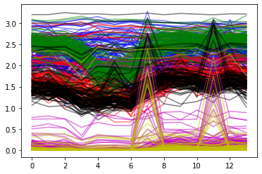
    


```python
ch_names = ['AF3','F7','F3','FC5','T7','P7','O1','O2','P8','T8','FC6','F4','F8','AF4']
bands = ['D_','T_','A_','B_','G1_','G2_']

feature_names = [[st+ch for ch in ch_names] for st in bands]
feature_names =  [f for flist in feature_names for f in flist]
#feature_names
```


```python
clf = ClassificationTree(max_depth=3)
clf.fit(X_train,y_train,feature_names=feature_names,verbose=1)
ytp = clf.predict(X_train)
ysp = clf.predict(X_test)

ytpr = clf.predict_proba(X_train)[:,1]
yspr = clf.predict_proba(X_test)[:,1]

print('Depth of trained Tree ', clf.getTreeDepth())
print('Accuracy')
print('- Training : ',np.mean(ytp==y_train))
print('- Testing  : ',np.mean(ysp==y_test))
print('Logloss')
Trloss = -np.mean(y_train*np.log(ytpr+1e-10)+(1-y_train)*np.log(1-ytpr+1e-10))
Tsloss = -np.mean(y_test*np.log(yspr+1e-10)+(1-y_test)*np.log(1-yspr+1e-10))
print('- Training : ',Trloss)
print('- Testing  : ',Tsloss)


plt.figure(figsize=(12,6))
clf.plotTree()
```

Number of features:: 84
Number of samples :: 100
---------------------------------------
|Building the tree.....................
|subtrees::|100%|-------------------->||
|.........................tree is buit!
---------------------------------------
Depth of trained Tree  3
Accuracy
- Training :  0.71
- Testing  :  0.5681818181818182
Logloss
- Training :  0.5147251478695971
- Testing  :  3.1215688661508283

    
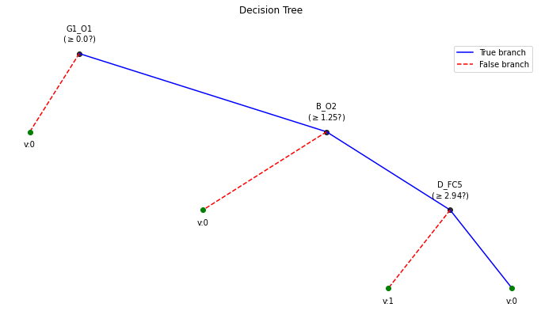
    


## Tuning ATAR

### Soft-thresholding


```python
PM1 = []
for beta in [0.01, 0.1,0.2, 0.3, 0.5, 0.7]:
    print('='*50)
    print('BETA = ',beta)
    print('='*50)
    Subj.correct(method='ATAR',verbose=1,winsize=128*5,
            wv='db3',thr_method='ipr',IPR=[25,75],beta=beta,k1=10,k2 =100,est_wmax=100,
            OptMode ='soft',fs=128.0,use_joblib=False, useRaw=True) 

    X0 = Subj.getEEG(useRaw=True).to_numpy()[fs*20:fs*35]
    X1 = Subj.getEEG(useRaw=False).to_numpy()[fs*20:fs*35]
    t = np.arange(len(X0))/fs

    plt.figure(figsize=(15,5))
    plt.subplot(121)
    plt.plot(t,X0 + np.arange(14)*50)
    plt.xlim([t[0],t[-1]])
    plt.xlabel('time (s)')
    #plt.ylabel('amplitude')
    plt.yticks(np.arange(14)*50,ch_names)
    plt.title(fr'raw-EEG')
    plt.subplot(122)
    plt.plot(t,X1+ np.arange(14)*50)
    plt.xlim([t[0],t[-1]])
    plt.xlabel('time (s)')
    #plt.ylabel('amplitude')
    plt.yticks(np.arange(14)*50,ch_names)
    plt.tight_layout()
    plt.title(fr'$\beta$={beta}')
    plt.show()
    
    
    X_train,y_train,X_test, y_test = Subj.getXy_eeg(task=3, redo=True)

    print('DataShape: ',X_train.shape,y_train.shape,X_test.shape, y_test.shape)
    
    
    clf = ClassificationTree(max_depth=3)
    clf.fit(X_train,y_train,feature_names=feature_names,verbose=1)
    ytp = clf.predict(X_train)
    ysp = clf.predict(X_test)

    ytpr = clf.predict_proba(X_train)[:,1]
    yspr = clf.predict_proba(X_test)[:,1]

    print('Depth of trained Tree ', clf.getTreeDepth())
    print('Accuracy')
    print('- Training : ',np.mean(ytp==y_train))
    print('- Testing  : ',np.mean(ysp==y_test))
    print('Logloss')
    Trloss = -np.mean(y_train*np.log(ytpr+1e-10)+(1-y_train)*np.log(1-ytpr+1e-10))
    Tsloss = -np.mean(y_test*np.log(yspr+1e-10)+(1-y_test)*np.log(1-yspr+1e-10))
    print('- Training : ',Trloss)
    print('- Testing  : ',Tsloss)


    plt.figure(figsize=(12,6))
    clf.plotTree()
    
    PM1.append([beta,np.mean(ytp==y_train),np.mean(ysp==y_test)])
    
    print('='*50)
    
PM1 = np.array(PM1)
```

!==================================================
BETA =  0.01
!==================================================
WPD Artifact Removal
WPD: True  Wavelet: db3 , Method: ipr , OptMode: soft
IPR= [25, 75] , Beta: 0.01 , [k1,k2]= [10, 100]
Reconstruction Method: custom , Window: ['hamming', True] , (Win,Overlap)= (640, 320)
    
    
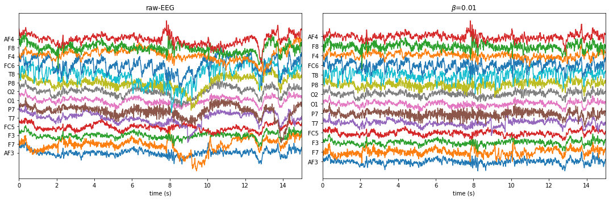


If you are running feature extraction with DIFFERENT parameters again to recompute, set redo=True, else function will return pre-computed features, if exist
To suppress this warning2, set redo_warn=False
100%|##################################################|100\100|Sg - 0|    
100%|##################################################|44\44|Sg - 0|    
DataShape:  (100, 84) (100,) (44, 84) (44,)
Number of features:: 84
Number of samples :: 100
---------------------------------------
|Building the tree.....................
|subtrees::|100%|-------------------->||
|.........................tree is buit!
---------------------------------------
Depth of trained Tree  2
Accuracy
- Training :  0.65
- Testing  :  0.4772727272727273
Logloss
- Training :  0.5705223432488816
- Testing  :  4.668722409182977
    

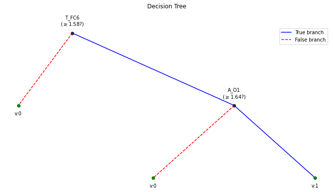


!==================================================
!==================================================
BETA =  0.1
!==================================================
WPD Artifact Removal
WPD: True  Wavelet: db3 , Method: ipr , OptMode: soft
IPR= [25, 75] , Beta: 0.1 , [k1,k2]= [10, 100]
Reconstruction Method: custom , Window: ['hamming', True] , (Win,Overlap)= (640, 320)
    
    


    
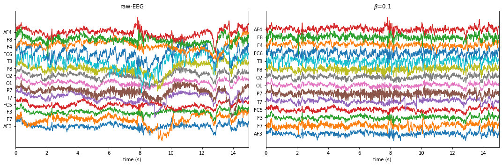
    


If you are running feature extraction with DIFFERENT parameters again to recompute, set redo=True, else function will return pre-computed features, if exist
To suppress this warning2, set redo_warn=False
100%|##################################################|100\100|Sg - 0|    
100%|##################################################|44\44|Sg - 0|    
DataShape:  (100, 84) (100,) (44, 84) (44,)
Number of features:: 84
Number of samples :: 100
---------------------------------------
|Building the tree.....................
|subtrees::|100%|-------------------->||
|.........................tree is buit!
---------------------------------------
Depth of trained Tree  3
Accuracy
- Training :  0.78
- Testing  :  0.5227272727272727
Logloss
- Training :  0.3627270549616331
- Testing  :  6.1363846139796685
    


    
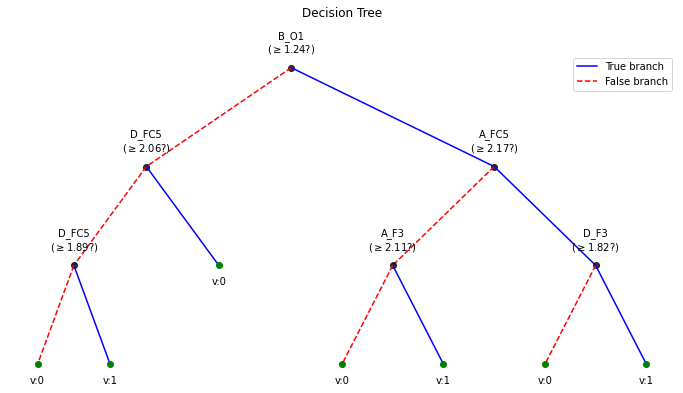
    


!==================================================
!==================================================
BETA =  0.2
!==================================================
WPD Artifact Removal
WPD: True  Wavelet: db3 , Method: ipr , OptMode: soft
IPR= [25, 75] , Beta: 0.2 , [k1,k2]= [10, 100]
Reconstruction Method: custom , Window: ['hamming', True] , (Win,Overlap)= (640, 320)
    
    

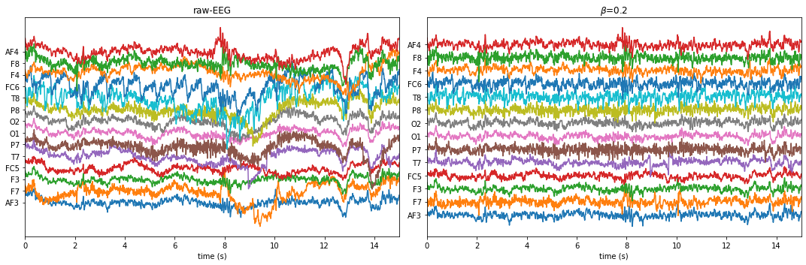
    


If you are running feature extraction with DIFFERENT parameters again to recompute, set redo=True, else function will return pre-computed features, if exist
To suppress this warning2, set redo_warn=False
100%|##################################################|100\100|Sg - 0|    
100%|##################################################|44\44|Sg - 0|    
DataShape:  (100, 84) (100,) (44, 84) (44,)
Number of features:: 84
Number of samples :: 100
---------------------------------------
|Building the tree.....................
|subtrees::|100%|-------------------->||
|.........................tree is buit!
---------------------------------------
Depth of trained Tree  3
Accuracy
- Training :  0.82
- Testing  :  0.5
Logloss
- Training :  0.3877860318279868
- Testing  :  5.221099864589396
    

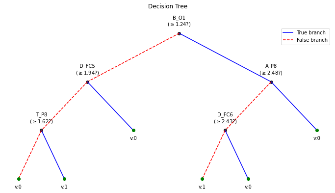
    


!==================================================
!==================================================
BETA =  0.3
!==================================================
WPD Artifact Removal
WPD: True  Wavelet: db3 , Method: ipr , OptMode: soft
IPR= [25, 75] , Beta: 0.3 , [k1,k2]= [10, 100]
Reconstruction Method: custom , Window: ['hamming', True] , (Win,Overlap)= (640, 320)


```python
plt.plot(PM1[:,0],PM1[:,1],label='Training')
plt.plot(PM1[:,0],PM1[:,2],label='Testing')
plt.xlabel(r'$\beta$')
plt.ylabel('accuracy')
plt.title('Soft-Thresholding')
plt.legend()
plt.show()
```


### Elimination mode


```python
PM2 = []
for beta in [0.01, 0.1,0.2, 0.3, 0.5, 0.7]:
    print('='*50)
    print('BETA = ',beta)
    print('='*50)
    Subj.correct(method='ATAR',verbose=1,winsize=128*5,
            wv='db3',thr_method='ipr',IPR=[25,75],beta=beta,k1=10,k2 =100,est_wmax=100,
            OptMode ='elim',fs=128.0,use_joblib=False, useRaw=True) 

    X0 = Subj.getEEG(useRaw=True).to_numpy()[fs*20:fs*35]
    X1 = Subj.getEEG(useRaw=False).to_numpy()[fs*20:fs*35]
    t = np.arange(len(X0))/fs

    plt.figure(figsize=(15,5))
    plt.subplot(121)
    plt.plot(t,X0 + np.arange(14)*50)
    plt.xlim([t[0],t[-1]])
    plt.xlabel('time (s)')
    #plt.ylabel('amplitude')
    plt.yticks(np.arange(14)*50,ch_names)
    plt.title(fr'raw-EEG')
    plt.subplot(122)
    plt.plot(t,X1+ np.arange(14)*50)
    plt.xlim([t[0],t[-1]])
    plt.xlabel('time (s)')
    #plt.ylabel('amplitude')
    plt.yticks(np.arange(14)*50,ch_names)
    plt.tight_layout()
    plt.title(fr'$\beta$={beta}')
    plt.show()
    
    
    X_train,y_train,X_test, y_test = Subj.getXy_eeg(task=3, redo=True)

    print('DataShape: ',X_train.shape,y_train.shape,X_test.shape, y_test.shape)
    
    
    clf = ClassificationTree(max_depth=3)
    clf.fit(X_train,y_train,feature_names=feature_names,verbose=1)
    ytp = clf.predict(X_train)
    ysp = clf.predict(X_test)

    ytpr = clf.predict_proba(X_train)[:,1]
    yspr = clf.predict_proba(X_test)[:,1]

    print('Depth of trained Tree ', clf.getTreeDepth())
    print('Accuracy')
    print('- Training : ',np.mean(ytp==y_train))
    print('- Testing  : ',np.mean(ysp==y_test))
    print('Logloss')
    Trloss = -np.mean(y_train*np.log(ytpr+1e-10)+(1-y_train)*np.log(1-ytpr+1e-10))
    Tsloss = -np.mean(y_test*np.log(yspr+1e-10)+(1-y_test)*np.log(1-yspr+1e-10))
    print('- Training : ',Trloss)
    print('- Testing  : ',Tsloss)


    plt.figure(figsize=(12,6))
    clf.plotTree()
    
    PM2.append([beta,np.mean(ytp==y_train),np.mean(ysp==y_test)])
    
    print('='*50)
    
PM2 = np.array(PM2)
```
