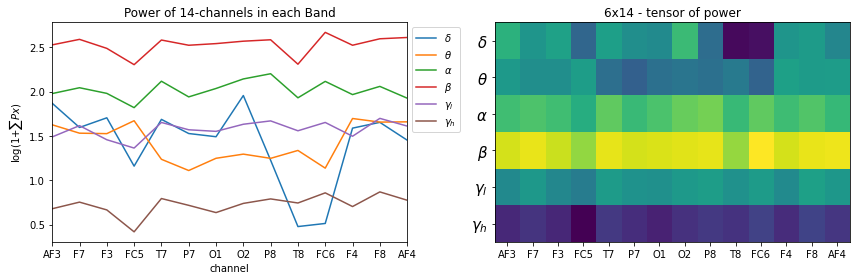

# Custom Frequency Bands for Feature Extraction
# Feature Engineering


In this notebook, we demonstrate, how we can extract Rhythmic features from EEG with custom frequency bands and more than just sum of power in a band, we will be extracting mean power, and standard deviation of power in a frequency band. We also exploint the feature of normializing, avoid using log-power and flattening the features.

We will be again focusing on a single task again - Semanticity Classification, though, we will not go into prediction models

<h1>Table of Contents<span class="tocSkip"></span></h1>
<div class="toc"><ul class="toc-item"><li><span><a href="#Download-and-Load-a-subject's-data" data-toc-modified-id="Download-and-Load-a-subject's-data-1"><span class="toc-item-num">1&nbsp;&nbsp;</span>Download and Load a subject's data</a></span></li><li><span><a href="#Pre-processing:-high-pass-&amp;-ATAR" data-toc-modified-id="Pre-processing:-high-pass-&amp;-ATAR-2"><span class="toc-item-num">2&nbsp;&nbsp;</span>Pre-processing: high-pass &amp; ATAR</a></span></li><li><span><a href="#T3-Task:-Semanticity-Prediction" data-toc-modified-id="T3-Task:-Semanticity-Prediction-3"><span class="toc-item-num">3&nbsp;&nbsp;</span>T3 Task: Semanticity Prediction</a></span></li><li><span><a href="#Feature-Extraction" data-toc-modified-id="Feature-Extraction-4"><span class="toc-item-num">4&nbsp;&nbsp;</span>Feature Extraction</a></span><ul class="toc-item"><li><span><a href="#Extract-default-power-of-6-freq-bands-and-flat-as-1D-vector-(default-setting)" data-toc-modified-id="Extract-default-power-of-6-freq-bands-and-flat-as-1D-vector-(default-setting)-4.1"><span class="toc-item-num">4.1&nbsp;&nbsp;</span>Extract default power of 6-freq bands and flat as 1D vector (default setting)</a></span></li><li><span><a href="#No-flattening---2D-Tensor" data-toc-modified-id="No-flattening---2D-Tensor-4.2"><span class="toc-item-num">4.2&nbsp;&nbsp;</span>No-flattening - 2D-Tensor</a></span></li><li><span><a href="#No-log10+1" data-toc-modified-id="No-log10+1-4.3"><span class="toc-item-num">4.3&nbsp;&nbsp;</span>No log10+1</a></span></li><li><span><a href="#Spatial-normalization-(For-each-band-normalize-over-channels)" data-toc-modified-id="Spatial-normalization-(For-each-band-normalize-over-channels)-4.4"><span class="toc-item-num">4.4&nbsp;&nbsp;</span>Spatial normalization (For each band normalize over channels)</a></span></li></ul></li><li><span><a href="#Custom-Frequency-Bands" data-toc-modified-id="Custom-Frequency-Bands-5"><span class="toc-item-num">5&nbsp;&nbsp;</span>Custom Frequency Bands</a></span></li>
<li>
<span><a href="#More-than-Sum-of-Power" data-toc-modified-id="More-than-Sum-of-Power-6"><span class="toc-item-num">6&nbsp;&nbsp;</span>More than Sum of Power</a></span></li></ul>
<li>
<span><a href="#Documentation" data-toc-modified-id="Documentation-7"><span class="toc-item-num">6&nbsp;&nbsp;</span>Documentation</a></span></li></ul>
</div>


```python
import numpy as np
import pandas as pd
import matplotlib.pyplot as plt
```

```python
#!pip install phyaat  # if not installed yet

import phyaat as ph
print('Version :' ,ph.__version__)
```

Version : 0.0.3
    

## Download and Load a subject's data


```python
# Download dataset of one subject only (subject=10)
# To download data of all the subjects use subject =-1 or for specify for one e.g.subject=10

dirPath = ph.download_data(baseDir='../PhyAAt/data/', subject=10,verbose=0,overwrite=False)

baseDir='../PhyAAt/data/' # or dirPath return path from above

#returns a dictionary containing file names of all the subjects available in baseDir
SubID = ph.ReadFilesPath(baseDir) 

#check files of subject=1
print(SubID[10])

# Create a Subj holding dataset of subject=1

Subj = ph.Subject(SubID[10])
```

Total Subjects :  3
{'sigFile': '../PhyAAt/data/phyaat_dataset/Signals/S10/S10_Signals.csv', 'txtFile': '../PhyAAt/data/phyaat_dataset/Signals/S10/S10_Textscore.csv'}


## Pre-processing: high-pass & ATAR


```python
#filtering with highpass filter of cutoff frequency 0.5Hz and lowpass with 24 Hz (no reason why)

Subj.filter_EEG(band =[0.5],btype='highpass',method='SOS',order=5)

ch_names = list(Subj.rawData['D'])[1:15]
fs=128

# Let's check the signals

X0 = Subj.getEEG(useRaw=True).to_numpy()[fs*20:fs*35,1]
X1 = Subj.getEEG(useRaw=False).to_numpy()[fs*20:fs*35,1]
t = np.arange(len(X0))/fs

plt.figure(figsize=(15,3))
plt.plot(t,X0,label='raw-eeg')
plt.plot(t,X1,label='filtered')


#Remving Artifact using ATAR, setting window size to 128*5 (5 sec), which is larg, but takes less time
Subj.correct(method='ATAR',verbose=1,winsize=128*5,
            wv='db3',thr_method='ipr',IPR=[25,75],beta=0.1,k1=10,k2 =100,est_wmax=100,
            OptMode ='elim',fs=128.0,use_joblib=False)


X1 = Subj.getEEG().to_numpy()[fs*20:fs*35,1]
plt.plot(t,X1,label='ATAR')
plt.xlim([t[0],t[-1]])
plt.xlabel('time (s)')
plt.ylabel('amplitude')
plt.legend()
plt.show()
```

WPD Artifact Removal
WPD: True  Wavelet: db3 , Method: ipr , OptMode: elim
IPR= [25, 75] , Beta: 0.1 , [k1,k2]= [10, 100]
Reconstruction Method: custom , Window: ['hamming', True] , (Win,Overlap)= (640, 320)
    

    
## T3 Task: Semanticity Prediction

## Feature Extraction

### Extract default power of 6-freq bands and flat as 1D vector (default setting)

* **by default six frequency bands are used**
* **delta (<=4), theta (4-8), alpha (8-14), beta (14,30), Gamma_low (30,47), Gamma_high (47<=)**


```python
fband_names = [r'$\delta$', r'$\theta$', r'$\alpha$', r'$\beta$', r'$\gamma_{l}$', r'$\gamma_h$']
```


```python
X_train,y_train,X_test,y_test = Subj.getXy_eeg(task=3,redo=True,normalize=False, log10p1=True,
                               flat=True, filter_order=5, filter_method='SOS', method='welch', window='hann',
                               scaling='density', detrend='constant', period_average='mean',
                               fBands=[], Sum=True, Mean=False, SD=False,verbose=0,
                               useRaw=False,redo_warn=True,use_v0=False)
print('DataShape: ',X_train.shape,y_train.shape,X_test.shape, y_test.shape)
```

If you are running feature extraction with DIFFERENT parameters again to recompute, set redo=True, else function will return pre-computed features, if exist
To suppress this warning2, set redo_warn=False
100%|##################################################|100\100|Sg - 0|    
100%|##################################################|44\44|Sg - 0|    
DataShape:  (100, 84) (100,) (44, 84) (44,)
    


```python
plt.figure(figsize=(15,3))
plt.plot(np.arange(X_train[0].shape[0]),X_train[0],label='')
plt.ylim([None, 3])
_ = [plt.axvline(i,ls='--',color='k',lw=1) for i in range(0,6*14+2,14)]

_ = [plt.text(i*14+3,2.8,f'Band-{fband_names[i]}') for i in range(6)]

plt.title('Power of 14-channels in each Band')
plt.xticks(range(0,6*14+1,14))
plt.ylabel(r'log(1+$\sum{Px}$)')
plt.show()
```
    

    

### No-flattening - 2D-Tensor


```python
X_train,y_train,X_test,y_test = Subj.getXy_eeg(task=3,redo=True,normalize=False, log10p1=True,
                               flat=False, filter_order=5, filter_method='SOS', method='welch', window='hann',
                               scaling='density', detrend='constant', period_average='mean',
                               fBands=[], Sum=True, Mean=False, SD=False,verbose=0,
                               useRaw=False,redo_warn=True,use_v0=False)
print('DataShape: ',X_train.shape,y_train.shape,X_test.shape, y_test.shape)
```

If you are running feature extraction with DIFFERENT parameters again to recompute, set redo=True, else function will return pre-computed features, if exist
To suppress this warning2, set redo_warn=False
100%|##################################################|100\100|Sg - 0|    
100%|##################################################|44\44|Sg - 0|    
DataShape:  (100, 6, 14) (100,) (44, 6, 14) (44,)
    


```python
plt.figure(figsize=(12,4))
plt.subplot(121)
_ = [plt.plot(X_train[0][i],label=f'{fband_names[i]}') for i in range(6)]

plt.xticks(np.arange(14),ch_names)
plt.xlabel('channel')
plt.title('Power of 14-channels in each Band')
plt.ylabel(r'log(1+$\sum{Px}$)')
plt.legend(bbox_to_anchor=(1,1))
plt.xlim([0,13])

plt.subplot(122)
plt.imshow(X_train[0], aspect='auto')

plt.title('6x14 - tensor of power')
plt.xticks(np.arange(14),ch_names)
#plt.yticks(np.arange(6),[f'band-{i+1}' for i in range(6)])
plt.yticks(np.arange(6),fband_names,fontsize=15)

plt.tight_layout()
plt.show()
```

    


### No log10+1

* **log10+1 is a way to have stable and meaning ful values, if +1 is not used, any value below 1 will be very high in magnitude towards negative**
* **y = log(x+1) before log make sure, if x=0 --> y=0**


```python
X_train,y_train,X_test,y_test = Subj.getXy_eeg(task=3,redo=True,normalize=False, log10p1=False,
                               flat=False, filter_order=5, filter_method='SOS', method='welch', window='hann',
                               scaling='density', detrend='constant', period_average='mean',
                               fBands=[], Sum=True, Mean=False, SD=False,verbose=0,
                               useRaw=False,redo_warn=True,use_v0=False)
print('DataShape: ',X_train.shape,y_train.shape,X_test.shape, y_test.shape)
```

If you are running feature extraction with DIFFERENT parameters again to recompute, set redo=True, else function will return pre-computed features, if exist
To suppress this warning2, set redo_warn=False
100%|##################################################|100\100|Sg - 0|    
100%|##################################################|44\44|Sg - 0|    
DataShape:  (100, 6, 14) (100,) (44, 6, 14) (44,)
    


```python
plt.figure(figsize=(12,4))
plt.subplot(121)
_ = [plt.plot(X_train[0][i],label=f'{fband_names[i]}') for i in range(6)]

plt.xticks(np.arange(14),ch_names)
plt.xlabel('channel')
plt.title('Power of 14-channels in each Band')
plt.ylabel(r'$\sum{Px}$')
plt.legend(bbox_to_anchor=(1,1))
plt.xlim([0,13])
plt.xticks(np.arange(14),ch_names)

plt.subplot(122)
plt.imshow(X_train[0], aspect='auto')

plt.title('6x14 - tensor of power')
plt.xticks(np.arange(14),ch_names)
#plt.yticks(np.arange(6),[f'band-{i+1}' for i in range(6)])
plt.yticks(np.arange(6),fband_names,fontsize=15)

plt.tight_layout()
plt.show()
```


### Spatial normalization (For each band normalize over channels)

* **The idea is to see which part of brain is more active relative to other parts in a given frequency band**
* **This will loose the relative differences between groups**


```python
X_train,y_train,X_test,y_test = Subj.getXy_eeg(task=3,redo=True,normalize=True, log10p1=True,
                               flat=False, filter_order=5, filter_method='SOS', method='welch', window='hann',
                               scaling='density', detrend='constant', period_average='mean',
                               fBands=[], Sum=True, Mean=False, SD=False,verbose=0,
                               useRaw=False,redo_warn=True,use_v0=False)
print('DataShape: ',X_train.shape,y_train.shape,X_test.shape, y_test.shape)
```

    If you are running feature extraction with DIFFERENT parameters again to recompute, set redo=True, else function will return pre-computed features, if exist
    To suppress this warning2, set redo_warn=False
    100%|##################################################|100\100|Sg - 0|    
    100%|##################################################|44\44|Sg - 0|    
    DataShape:  (100, 6, 14) (100,) (44, 6, 14) (44,)
    


```python
plt.figure(figsize=(12,4))
plt.subplot(121)
_ = [plt.plot(X_train[0][i],label=f'{fband_names[i]}') for i in range(6)]

plt.xlabel('channel')
plt.title('Power of 14-channels in each Band')
plt.ylabel(r'$\sum{Px}$')
plt.legend(bbox_to_anchor=(1,1))
plt.xticks(np.arange(14),ch_names)
plt.xlim([0,13])

plt.subplot(122)
plt.imshow(X_train[0], aspect='auto')

plt.title('6x14 - tensor of power')
plt.xticks(np.arange(14),ch_names)
plt.yticks(np.arange(6),fband_names,fontsize=15)

plt.tight_layout()
plt.show()
```


## Custom Frequency Bands 

```python
fBands      = [[None,8],[8,24],[24,32]]
fband3_names= [r'$\delta$+$\theta$',r'$\alpha$',r'$\beta$']

# for low-pass [None, fc] and for high pass [fc,None] is used
```


```python
X_train,y_train,X_test,y_test = Subj.getXy_eeg(task=3,redo=True,normalize=False, log10p1=True,
                               flat=False, filter_order=5, filter_method='SOS', method='welch', window='hann',
                               scaling='density', detrend='constant', period_average='mean',
                               fBands=fBands, Sum=True, Mean=False, SD=False,verbose=0,
                               useRaw=False,redo_warn=True,use_v0=False)
print('DataShape: ',X_train.shape,y_train.shape,X_test.shape, y_test.shape)
```

If you are running feature extraction with DIFFERENT parameters again to recompute, set redo=True, else function will return pre-computed features, if exist
To suppress this warning2, set redo_warn=False
100%|##################################################|100\100|Sg - 0|    
100%|##################################################|44\44|Sg - 0|    
DataShape:  (100, 3, 14) (100,) (44, 3, 14) (44,)


```python
plt.figure(figsize=(12,4))
plt.subplot(121)
_ = [plt.plot(X_train[0][i],label=f'{fband3_names[i]}') for i in range(len(fband3_names))]

plt.xlabel('channel')
plt.title('Power of 14-channels in each Band')
plt.ylabel(r'$\sum{Px}$')
plt.legend(bbox_to_anchor=(1,1))
plt.xticks(np.arange(14),ch_names)
plt.xlim([0,13])

plt.subplot(122)
plt.imshow(X_train[0], aspect='auto')

plt.title('3x14 - tensor of power')
plt.xticks(np.arange(14),ch_names)
plt.yticks(np.arange(len(fband3_names)),fband3_names,fontsize=15)

plt.tight_layout()
plt.show()
```
    


## More than Sum of Power

* **While computing power in each, we compute total power, however, sometimes, it is in interest to know the variation of power in given band**
* **It is uniformly distribuate or very peak**
* **So we compoute SD and Mean (Mean will be almost same as total power, since all of them will be divided by same number)**


```python
X_train,y_train,X_test,y_test = Subj.getXy_eeg(task=3,redo=True,normalize=False, log10p1=True,
                               flat=False, filter_order=5, filter_method='SOS', method='welch', window='hann',
                               scaling='density', detrend='constant', period_average='mean',
                               fBands=fBands, Sum=True, Mean=True, SD=True,verbose=0,
                               useRaw=False,redo_warn=True,use_v0=False)
print('DataShape: ',X_train.shape,y_train.shape,X_test.shape, y_test.shape)
```

If you are running feature extraction with DIFFERENT parameters again to recompute, set redo=True, else function will return pre-computed features, if exist
To suppress this warning2, set redo_warn=False
100%|##################################################|100\100|Sg - 0|    
100%|##################################################|44\44|Sg - 0|    
DataShape:  (100, 3, 3, 14) (100,) (44, 3, 3, 14) (44,)
    


```python
STS = ['Sum', 'Mean','SD']
for k, st in enumerate(STS):
    plt.figure(figsize=(12,4))
    plt.subplot(121)
    _ = [plt.plot(X_train[0][k][i],label=f'{fband3_names[i]}') for i in range(len(fband3_names))]

    plt.xlabel('channel')
    plt.title('Power of 14-channels in each Band')
    if k==0: plt.ylabel(r'$\sum{Px}$')
    if k==1: plt.ylabel(r'$E\{Px\}$')
    if k==2: plt.ylabel(r'$sd\{Px\}$')
    plt.legend(bbox_to_anchor=(1,1))
    plt.xticks(np.arange(14),ch_names)
    plt.xlim([0,13])

    plt.subplot(122)
    plt.imshow(X_train[0][k], aspect='auto')

    plt.title(f'3x14 - tensor of power - {st}')
    plt.xticks(np.arange(14),ch_names)
    plt.yticks(np.arange(len(fband3_names)),fband3_names,fontsize=15)

    plt.tight_layout()
    plt.show()
```


    

    

    

## Documentation


```python
## Feature Extraction - Rhythmic Features
help(Subj.getXy_eeg)
```

Help on method getXy_eeg in module phyaat.ProcessingLib:

getXy_eeg(task=1, features='rhythmic', eSample=[0, 0], redo=False, split='serial', splitAt=100, normalize=False, log10p1=True, flat=True, filter_order=5, filter_method='lfilter', method='welch', window='hann', scaling='density', detrend='constant', period_average='mean', winsize=-1, hopesize=None, fs=128, fBands=[], Sum=True, Mean=False, SD=False, use_joblib=False, n_jobs=-1, verbose=0, use_v0=True, useRaw=False, include_win_ind=False, redo_warn=True) method of phyaat.ProcessingLib.Subject instance
    task    :: int: {1,2,3,4,-1}, if task=-1, it will return label for all tasks e.g. y-shape=(n,4), each column for each task
        task=1 : Attention Level Prediction
        task=2 : Noise Level Prediction
        task=3 : Semanticity Prediction
        task=4 : LWR classification
        task=-1: All four

    features:: str: 'rhythmic', ['wavelet', 'spectorgram', .. ] not implemented yet
             : 'rhythmic', returns power of 6 frequency bands for each channel for each window or segment

    eSample :: list: [0,0], Extra samples before and after segment, [64,64] will add 64 samples before start and 64 after ends
             : helpful for ERP analysis

    redo  :: bool: False, to save the computational repetititon. If features from required segments are already extracted,
          will not be extracted again, unless redo=True. If features are extracted for task 1 (listening segments),
          then for task 2 and task 3, not required to compute again, but for task 4 or task=-1, it would compute again.
          If you processed the raw signal again, set redo=True to extract features again.

    split:: str: 'serial', 'random' : Serial split will split the segments in serial temporal order. First 'splitAt' segments
           will be in training set, rest will be in testing set. 'random' split will shuffle the order of segments first
           then split. 'serial' split is to evaluate the predictive of future instances (testing segments) from
           past instances (training segments).

    normalize:: bool: False, if normalize the power of each band to observe the spatial power distribuation of EEG in one band.
        normalizing will loose the relative differences in power among different bands, since sum of total power in
        a band across all the channel will be 1.
    log10p1:: bool: True, compute logrithim power, using log(x+1) to avoid small values getting very high negative values

    flat:: bool: True, to flatten the features from 6x14 to 84, if False, will return shape of features (n,6,14) else (n,84)

    winsize: int -1 or +int, if -1, features will be extracted using Segment-wise framwork or window-wise framework.
             If winsize=-1: output shape of X will (n,nf), where n = number of segments
             If winsize>1 : output shape of X will (m,nf), where m = total number of windows from all the segments
             For details please refere to the article.

    hopesize: if None, =winsize//2, overlapping samples if winsize>1 (window-wise feature extraction)

    Parameters for Computation of spectral power
    -------------------------------------------
    filter_order: 5, order of IIR filter
    filter_method = 'lfilter', 'filtfilt', 'SOS'
    method : 'welch' or None, method for periodogram
    window : 'hann', or scipy.signal.get_window input string e.g. 'ham','box'
    scaling: 'density'--V**2/Hz 'spectrum'--V**2
    detrend: False, 'constant', 'linear'
    average: 'mean', 'median'   #periodogram average method


    use_v0: if True, old version of Rhythmic Feature Extraction is used with limited control over parameters,
            in which case following parameters will be ignored:
            filter_method='lfilter', fBands=[],Sum=True, Mean=False, SD=False, use_joblib=False,n_jobs=-1,verbose=0
            To make use of above parameters, use use_v0=False.


    Paprameters for Rhythmic features: When use_v0==False
    =======================================================
    # For different filtering method
    -------------------------------
    filter_method = 'lfilter', 'filtfilt', 'SOS'

    # For Custum Frequency Bands
    ---------------------------
    fBands = list of frequency bands, if empty then fBands =[[None,4],[4,8],[8,14],[14,30],[30,47],[47, None]]
        for lowpass, use [None, fc] and for highpass use [fc, None]
        example:
        fBands =[[None,8],[8,16],[24,None]] for three custum frequency bands

    # For aggregating Power as Sum, Mean or/and SD
    -------------------------------------------------
    (Sum=True,Mean=False,SD=False) To compute, sum of total power, mean of total power or/and SD of total power in specified frequency band
     - At least one of them should be True
     - For more than one true, features are concatenated as additional axis in order of Sum, Mean, SD

     # To use parallel processing for fast computation
     use_joblib=False,n_jobs=-1

     Output
     ======
     X_train,y_train,X_test,y_test

     shape:  X_train, X_test:  (nW, len(fBands), nch)
             where nW is number of windows used. if winsize==-1, then nW=nSegments, feature are extracted segment-wise
             len(fBands) is number of frequency bands specified in fBands, if empty list was passed, then 6 frequency bands are used by default
             nch is number of channels
        if more than one of (Sum,Mean,SD) is True, then shapes are:
             X_train, X_test:  (nW,aggN ,len(fBands), nch)
             where aggN=2 or three, and they are ordered as [Sum,Mean,SD]
        if flat True:
            Then last two dimensions are flattened, e.g. (nW, len(fBands)*nch) or (nW,aggN,len(fBands)*nch)

    shape:  y_train, y_test: (nW,) corresponding label for chosen task (1,2,3,4)
            if winsize>16, and include_win_ind=True,
            y_train, y_test: (nW,2), where first column will be label of corresponding task, and second column will be
            index of a window within a segment

            For example: if a listening segment is 5 sec long and selected winsize=128, (1sec), with 0.5sec overlapping, then there will
            5+4 =9 windows within this segment, for each window, index will be such as  0,1,2,3, ...8. and it will start again from 0 for
            next segment.

            This can be useful for temporal models such as RNN, where you like to provid all the windows of one segment as a sequence

        if task =-1:
            shape = (nW,5), where first 4-columns are labels for first four tasks (At_level, Noise_level, Semanticity, LWR)
            5th column is a sequence of window within a segment, which is useful only when winsize>16, else 5th column will be all zeros


