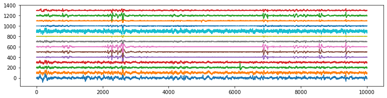
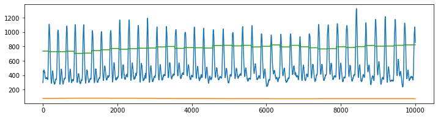

<!--
<b>being update ...</b> 
 -->

Execute all the Notebook with  

# Machine Learning Models
<!--<h2 style="text-align:left;"><u>Getting Started - Table of Content</u></h2> -->

  

  
  
<a class="reference internal" href="../introduction"><b>Getting Started: Introduction</b> Installation, download data and extract segments and features for predictive analysis</a><a class="headerlink" href="#" title="Permalink to this image">¶</a>

  

  
  
<a class="reference internal" href="1_QuickStartSVM"><b>A quick start with SVM (LWR task)</b>Starting with LWR classification using Rhythmic features (spectral) without artifact removal</a>

  

  
  
<a class="reference internal" href="2_PredictiveTasksUsingSVM"><b>All four predictive tasks using SVM</b> Applying ICA based artifact removal, Segment-wise feature extraction</a>

  

  
  
<a class="reference internal" href="3_TuningPreprocessing"><b>Tuning the preprocessing parameters</b> Tuning the parameters of filtering and Artifact removal method</a>

  

  
  
<a class="reference internal" href="4_FeatureExtraction"><b>Feature Extraction Framework</b> Segment-wise & Window-wise feature extraction, for details check the article</a>

  

  

  
  
  
  
<a class="reference internal" href="5_UsingExternalLibraries"><b>Using External Libraries</b> Extract EEG, GSR, and PPG signals, process with other libraries or your own custom function and apply predictive modeling</a>

  

  
  
<a class="reference internal" href="6_Modeling_with_DecisionTree"><b>Using Decision Tree to analyse</b> Applying decision tree to identify the important predictor from spectral features</a>

  

 

<h3 style="text-align:left;">
<ul class="simple" style="line-height:1.4;">
  <li>With Wavelet Based artifact removal - <i>will be updated soon</i></li>
  <li></li>
  <li></li>
</ul>
</h3>

# Deeplearning and Temporal Models
In this section, the exmples includes preditive modeling with convolutional and temporal models such as CNN, RNN and Bayesian Network

<h3 style="text-align:left;">
<ul class="simple" style="line-height:1.4;">
  <li>Using 1D CNN - <i>will be updated later</i></li>
  <li>Using LSTM - <i>will be updated later</i></li>
  <li></li>
</ul>
</h3>

  
  
<a class="reference internal" href="https://arxiv.org/pdf/2206.09807.pdf"><b>Deep Representation fo EEG</a>

  

  
 

 

## Contribute and record your results
Everyone is invited to use the dataset and build better models. You can record your performance metric on leaderboard at **PaperwithCode** here **[https://paperswithcode.com/dataset/phyaat](https://paperswithcode.com/dataset/phyaat)**

Additionally, you could also upload your code on cloud, to reproduce the results and once you do that, you could send us the link to your code and we will add your predictive model in above collections. In order to do that, make sure, your code is self-contained (includes all the dependencies and libraries) and easy to execute.
