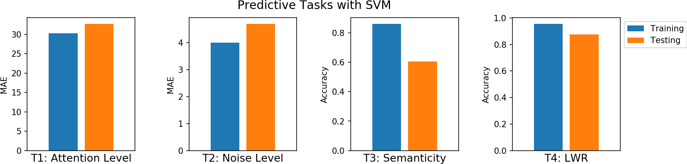

<!--
<b>being update ...</b> 
 -->

# Machine Learning Models
<!--<h2 style="text-align:left;"><u>Getting Started - Table of Content</u></h2> -->

Execute all the Notebook with  

<h3 style="text-align:left;">
<ul class="simple" style="line-height:1.4;">
  <li><a href="../introduction" target="_blank">Introduction: Getting Started</a>
   Installation, download data and extract segments and feautures for predictive analysis</li>
  <li><a href="1_QuickStartSVM" target="_blank">A quick start with SVM (LWR task)</a>
   Starting with LWR classification using Rhythmic features (spectral) without artifact removal</li>
  <li><a href="2_PredictiveTasksUsingSVM" target="_blank"><u>All four predictive tasks using SVM</u></a>
   Applying ICA based artifact removal, Segment-wise feature extreaction </li>
  <li><a href="3_TuningPreprocessing" target="_blank">Tuning the preprocessing parameters</a>
   Tuning the paraters of filtering and Artifact removal method</li>
  <li><a href="4_FeatureExtraction" target="_blank">Feature Extraction Framework</a>
   Segment-wise & Window-wise feature extraction, for details check the article</li>
  <li><a href="5_UsingExternalLibraries" target="_blank">Using Extranal Libraries</a>
   Exract EEG, GSR, and PPG signals, process with other libraries or your own custum function and apply predictive modeling</li>

  <li>With Wavelet Based artifact removal - <i>will be updated soon</i></li>
  <li></li>
  <li></li>
</ul>
</h3>

# Deeplearning and Temporal Models
In this section, the exmples includes preditive modeling with convolutional and temporal models such as CNN, RNN and Bayesian Network

<h3 style="text-align:left;">
<ul class="simple" style="line-height:1.4;">
  <li>Using 1D CNN - <i>will be updated later</i></li>
  <li>Using LSTM - <i>will be updated later</i></li>
  <li></li>
</ul>
</h3>

